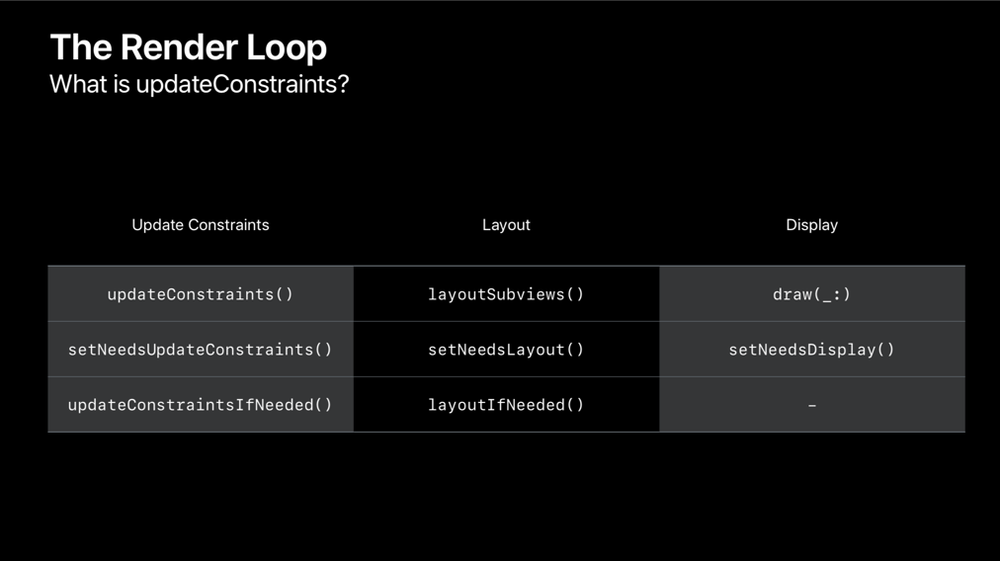
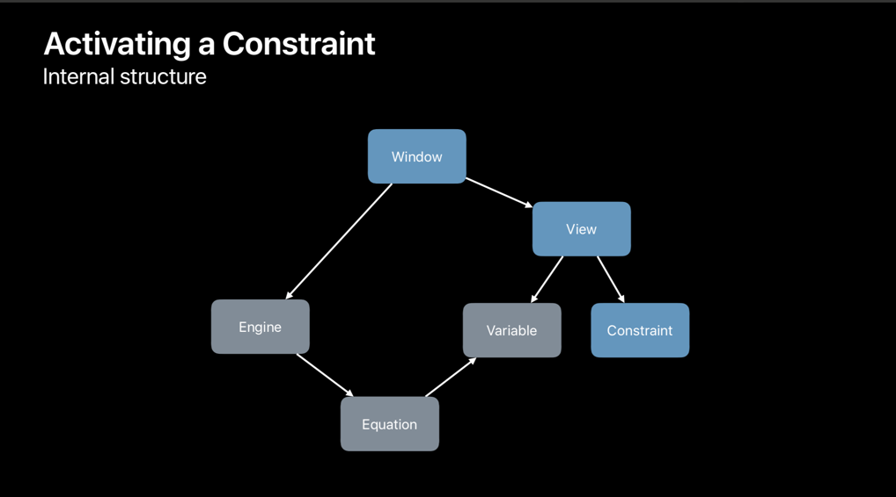

* content
{:toc}

## 2018 WWDC 정리 : High Performance Auto Layout

어떻게 AutoLayout 을 작성해야 더 나은 성능을 낼 수 있을까? 를 확인하려면 내부적으로 Constraint 를 사용할 때 어떻게 작동하는지에 대해서 생각해봐야 한다.

### 화면이 그려질 때마다 Constraint 를 모두 제거했다가 다시 생성한다면?

Update Constraint 함수는 Render loop에 속해있습니다.

Render Loop는 매초 120 회 실행되는 프로세스입니다. Reder loop를 통해 각 프레임마다 모든 콘텐츠를 보여줄 수 있습니다. Render loop는 제약 조건, 레이아웃 및 표시 업데이트의 세 단계로 구성됩니다.

이러한 함수들은 매 프레임마다 호출될 수 있으며, 1 초에 120 프레임을 실행하기 때문에 위와 같은 케이스에서는 많은 문제가 발생할 수 있습니다.

* Render loop는 필요하다면 유용하지만, 너무 많이 호출되니까 너무 민감한 코드는 쓰지말고 이왕이면 Interface Builder 를 사용하자.
* 코드로 작성한다면 매번 Constraint 를 새로 작성하지 말고 Constraint 가 작성되는 부분은 한 번만 호출되도록 변경하자.

### Activating a Constraint

View 는 Window에 붙어있고, Window는 엔진과 연결되어 있으며, 이 엔진이 오토 레이아웃의 핵심입니다. View에 제약 조건이 부여되면, 제약 조건에 해당하는 방정식을 만들고 엔진에 방정식을 추가합니다.

 방정식에는 최소 X, 최소 Y, 너비 및 높이의 네 가지 변수가 있으며 엔진은 이를 주어진 방정식을 기준으로 계산합니다. 새로운 제약조건이 활성화 되면 엔진이 다시 변수를 계산하고 다음 Render loop 때 이 변경값을 반영합니다.

 엔진은 레이아웃에 대한 캐시값을 저장하고 있고 지속적으로 레이아웃 요소들을 tracking 하고 있습니다.

## Building a More Performance Layout

#### Model the problem naturally

두 개의 레이아웃에 대한 컨스트레이트를 하나로 작성하지 말고 각각 고유의 컨스트레인트를 주는 것이 좀 더 직관적이며 효율적입니다.

#### View를 제거하는 것보다는 hidden 설정을 주는 것이 비용이 적게 듭니다.

비슷한 형태의 reusable cell 이라면 view를 공통으로 사용하고 hidden을 사용하는 건 어떨까요?

#### 제약 조건을 지우고 새로 추가 하는 것보다는 기존이 제약조건을 수정하는 것이 낫습니다.

#### Constraint Churn

* Avoid removing all constraints
* Add static constraints once
* Only change ther constraints that need changing
* Hide views instead of removing them.
