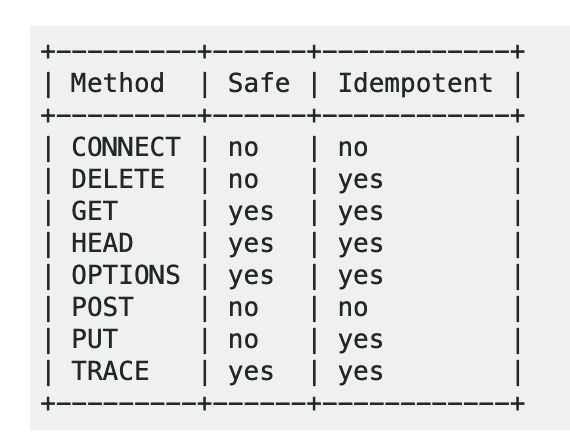

* content
{:toc}

안녕하세요! caution입니다.
### 암호화 방식
#### 대칭 키 암호화
동일하게 암호화를 풀어내는 방식(키)를 가지고 있어서 암호화된 파일을 해독할 수 있다.
둘 다 모두 동일한 키를 가지고 있어야 한다. 맨 초기에 키를 함께 전송한다면 중간에 가로채서(Man in the Middle Attack) 문제가 발생할 수 있다.
#### 비대칭 키 암호 (공개키 방식)
공개키와 개인키 두 개의 키로 서로 암호화와 복호화를 한다.
공개키로 암호화하면 개인키로 복호화 할 수 있으며 개인키로 암호화하면 공개키로 복호화할 수 있다.
B가 A에게 메세지를 보내려고 한다.
1. B->A 연결한다.
2. A->B에게 공개 키(public key)를 보내고 개인 키(private key)는 보내지 않는다.
3. B->A 이 공개키로 메시지를 암호화하여 전송한다.
4. A가 개인키로 복호화한다.

##### 대칭 암호화는 빠르고 비대칭 암호화는 신뢰성이 높지만 메세지만 전달하는 것보다 느리다.
그래서 대칭키를 교환할 때에만 비대칭 암호화(공개키방식)를 사용한다. 실제 데이터는 대칭키 방식으로 암호화를 한다.
### SSL
신뢰할 만한 인증 기관(CA)이 발행한 인증서를 2단계에서 public key 와 함께 보낸다.
#### SSL 인증서의 내용
1. 서비스의 정보 : 인증서를 발급한 CA, 서비스 도메인
2. 서버 측 공개키 : 공개키의 내용, 공개키의 암호화 방법
위 내용은 **CA에 의해서 공개키 방식으로 암호화**된다.
#### SSL 통신 단계
##### STEP 1. 악수(Handshake)
상대가 존재하는지, 데이터를 주고 받기 위해 어떤 방법을 사용해야 하는지를 파악합니다. 브라우저와 서버가 핸드쉐이크를 하면서 SSL 인증서를 주고 받습니다.
1. Client Hello : 클라이언트가 서버에 접속합니다.
    * 클라이언트 측에서 생성한 랜덤 데이터를 전송합니다.
    * 클라이언트가 지원하는 암호화 방식들을 전송합니다.
    * 이미 SSL Handshaking을 했다면 기존 세션을 재활용하기 위해서 세션 아이디를 전송합니다.
2. Server Hello : 서버가 클라이언트에게 데이터를 전송합니다.
    * 서버가 생성한 랜덤 데이터를 전송합니다.
    * 서버가 **선택한 클라이언트 암호화 방식**을 전달합니다.
    * **SSL 인증서**를 전송합니다.
3. 서버의 인증서가 CA에 의해서 발급된 건지 확인합니다.
    * 브라우저는 **CA 리스트**와 함께 각 기관별 **공개키**를 가지고 있습니다. 이를 이용해서 인증서를 복호화에 성공하면 이 인증서를 전송한 서버를 믿을 수 있게 됩니다.
    * pre master secret = 서버의 랜덤 데이터 + 클라이언트의 랜덤 데이터
    * pre master secret 키를 **SSL 인증서 안에 있던 서버의 공개키로 암호화를 하여 서버에 전송합니다.**
4. 서버가 클라이언트가 전송한 pre master secret 키를 개인키로 복호화 합니다.
    * 이를 기반으로 master secret > session key를 생성합니다.
    * 이 session key를 대칭키로 사용하여 데이터를 암호화 하여 주고 받습니다.
5. 클라이언트와 서버는 Handshake 단계가 종료되었음을 알려줍니다.

##### STEP 2. 세션
실제로 서버와 클라이언트가 데이터를 주고 받는 단계입니다. session key를 이용해서 대칭키 방식으로 암호화하여 전송합니다. 클라이언트와 서버가 모두 session key를 가지고 있기 때문에 서로 암호화 복호화가 가능합니다.
##### STEP 3. 세션 종료
데이터의 전송이 끝나면 SSL 통신이 끝났음을 알려준다. **세션키를 폐기**한다.


### HTTP Method

```POST```는 새로운 곳에 리소스가 계속 추가되는 것 (insert)
```PUT```은 지정된 위치에 생성 또는 업데이트 하는 것 (update) : 몇 번이고 반복해도 같은 값이 나온다.
```OPTIONS``` : 웹서버에서 지원되는 메소드의 종류를 확인할 경우 사용.
```CONNECT``` : 동적으로 터널 모드를 교환, 프락시 기능을 요청시 사용.
```TRACE``` : 원격지 서버에 루프백 메시지 호출하기 위해 테스트용으로 사용.

### Response Code
##### 100 : 정보 전송, 임시응답
|응답코드|오류|설명|
|:---:|:---:|:---|
|100|Continue |클라이언트로 부터 일부 요청을 받았으며 나머지 정보를 계속 요청함|
|101|Switching protocols||
##### 200 : 성공
|응답코드|오류|설명|
|:---:|:---:|:---|
|200|OK||
|201|Created||
202|Accepted||
203|Non-authoritative information|서버가 클라이언트 요구 중 일부만 전송|
204|No content|PUT,POST,DELETE Request가 성공했지만 전송할 데이터가 없음|
##### 300 : 리다이렉션
|응답코드|오류|설명|
|:---:|:---:|:---|
|301|Moved permanently|요구된 데이터를 변경된 타 URL에 요청함|
|302|Not temporarily|
|304|Not modified|로컬 캐시 정보 사용|
##### 400 : 클라이언트 요청에러
|응답코드|오류|설명|
|:---:|:---:|:---|
|400|Bad Request|사용자의 잘못된 요청을 처리할 수 없음|
|401|Unauthorized|인증이 필요한 페이지를 요청한 경우|
|402|Payment required|예약됨|
|403|Forbidden|접근 금지|
|404|Not found|요청 페이지 없음|
|405|Method not allowed|허가되지 않은 http method 사용|
|407|Proxy authentication required|프락시 인증 요구됨|
|408|Request timeout|요청 시간 초과|
|410|Gone|영구 사용 금지
|412|Precondition failed|전제조건 실패|
|414|Request-URI too long|

##### 500 : 서버 오류
|응답코드|오류|설명|
|:---:|:---:|:---|
|500|Internal server error|내부 서버 오류|
|501|Not implemented|웹 서버가 처리할 수 없음|
|503|Service unnailable|서비스 제공 불가|
|504|Gateway timeout|게이트웨이 시간 초과|
|505|HTTP version not supported|해당 HTTP 버전 지원되지 않음|

### Timeout
* **Connection time** : 클라이언트가 서버와 연결할 때까지 걸리는 시간
* **Read time** : 클라이언트가 서버에 연결한 뒤 응답을 받을 때까지 걸리는 시간

### 참조
 * [자바공작소](https://javaplant.tistory.com/18)
