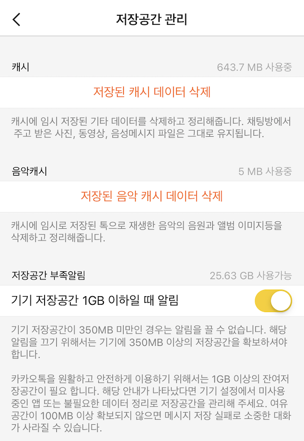

* content
{:toc}

안녕하세요! caution입니다.
오늘은 Caching에 대해 간략히 정리하고 Apple Framework가 제공하는 NSCache를 정리합니다.

### 캐싱이란?
 캐싱은 간단히 말하면 재사용될 수 있을 만한 자원을 특정영역에 저장해놓는 것을 의미합니다. 캐싱된 데이터가 있다면 추가적인 자원을 소모하지않고 캐싱 데이터를 가져다 쓸 수 있기 때문에 자원을 절약할 수 있고 애플리케이션의 처리 속도가 향상됩니다.

예를 들어 웹 브라우저를 사용하다 보면 새로고침을 사용할 때가 있는데요. 크롬에서 개발자 도구를 열어 놓은 상태에서 보조 클릭으로 새로고침을 누르면 다음과 같은 화면을 볼 수 있습니다.

 

마지막에 캐시 비우기 및 강력 새로고침 메뉴를 누르면 기존에 웹브라우저가 캐싱했던 리소스들을 제거하고 모든 데이터를 새롭게 요청하게 됩니다.

이렇듯 캐싱은 웹 브라우저부터 웹 서버, 하드디스크 및 CPU에 이르기까지 다양한 방면에서 적용되고 있습니다.

모바일 애플리케이션에서 매우 고화질의 이미지를 반복해서 보여주어야 하는데 캐싱이 없다면 어떻게 될까요? 고화질, 고용량의 이미지를 계속해서 다운로드하기 때문에 사용자의 네트워크 리소스를 소모할 것이고, 다운로드가 완료되기까지의 시간동안 사용자는 이미지를 확인할 수 없을 겁니다.

하지만 애플리케이션에 다운로드 받은 이미지를 캐싱하여 저장해둔다면, 이 이미지를 다운로드 받은 이후에는 별도의 리소스를 소모하지 않고 이미지를 빠르게 보여줄 수 있겠죠.

### Memory Caching vs Disk Caching
애플리케이션을 만들 때 캐싱은 크게 두 가지로 이루어집니다. Memory Caching과 Disk Caching이죠. Memory Caching은 애플리케이션의 메모리 영역의 일부분을 Caching에 사용하는 것입니다. 그 말인즉 애플리케이션이 종료되어 메모리에서 해제되면 이 영역에 있던 리소스들은 OS에 반환되면서 Memory Caching되어 있던 리소스들은 사라지게 됩니다.

반면 Disk Caching은 데이터를 파일 형태로 디스크에 저장하는 것입니다. Disk Caching이 반복적으로 발생하면 애플리케이션이 차지하는 용량이 커지지만, 앱을 껏다 켠다고 해서 데이터가 사라지지는 않습니다. Disk Caching의 가장 가까운 예로는 카카오톡에서 찾아볼 수 있겠네요.



카카오톡을 사용하다 보면 채팅방에서 이미지나 동영상 등 파일을 주고 받을 수 있습니다. 사용자가 동영상을 모바일로 저장하지 않더라도 동영상을 재생하기 위해서는 파일을 다운로드 받아야 하는데, 이때 이 다운로드 받은 파일들이 캐시 데이터에 포함됩니다. 계속 캐시 데이터가 늘어나면 저장공간을 많이 차지하게 되므로 필요하다면 사용자가 캐시 데이터를 삭제할 수 있도록 하거나, 특정 용량 이상을 차지하면 시스템에서 캐시 데이터를 삭제하도록 할 필요가 있습니다.

### NSCache
iOS 애플리케이션에서 Memory Caching 에 주로 사용되는 클래스입니다. NSCache가 무엇인지, [Apple 공식문서](https://developer.apple.com/documentation/foundation/nscache)를 통해 알아보겠습니다.

#### NSCache : Generic Class
key-value 형태의 데이터를 임시로 저장하는 데 사용할 수 있는 가변 컬렉션입니다. 자원이 부족할 때 삭제 대상이 됩니다.
##### Declaration
```swift
class NSCache<KeyType, ObjectType> : NSObject where KeyType : AnyObject, ObjectType : AnyObject
```
##### overview
캐시 대상은 다른 가변 컬렉션과는 다른 몇 가지 특성을 가집니다.
* NSCache 클래스는 캐시가 시스템 메모리를 너무 많이 사용하지 않도록 자동 삭제 정책을 가집니다. 다른 응용프로그램에서 메모리가 필요한 경우 이 정책은 캐시에서 일부 항목을 제거하여 메모리 사용 공간을 최소화합니다.
* 캐시를 잠글(lock) 필요 없이 별도 스레드에서 캐시 항목을 추가하고, 삭제하고 검색할 수 있습니다.
* NSMutableDictionary 객체와는 달리, 캐시는 그 안에 들어있는 키 객체를 복사하지 않습니다.

일반적으로 NSCache 객체를 사용하여 생성 비용이 많이 드는 일시적인 데이터 객체를 저장합니다. 값을 다시 계산할 필요가 없으므로 이러한 객체를 재사용하는 것은 성능상의 이점을 얻을 수 있습니다. 하지만 이러한 임시 객체들은 응용프로그램에 중요하지 않은 데이터이며, 메모리가 부족할 경우 삭제될 수 있습니다. 만약 삭제되었다면 이 값들이 필요할 때 다시 계산해야 합니다.

사용되지 않을 때 삭제될 수 있는 하위 구성 요소들은 NSDiscardableContent 프로토콜을 채택하여 캐시 제거 동작을 향상시킬 수 있습니다. 기본적으로 캐시의 NSDiscardableContent 객체는 내용이 삭제된 경우 자동으로 제거되지만 이 자동 제거 정책은 변경할 수 있습니다. NSDiscardableContent 객체가 캐시에 저장되면 캐시는 삭제 명령 수행 시 ```discardContentIfPossible()```을 호출합니다.
##### Topics
Managing the Name
* ```var name: String``` : 캐시의 이름

Managing Cache Size
* ```var countLimit: Int``` : 캐시가 가질 수 있는 최대한의 객체 수
* ```var totalCostLimit: Int``` : 객체를 제거하기 전에 캐시가 보유할 수 있는 최대 비용

Managing Discardable Content
* ```var evictsObjectsWithDiscardedContent: Bool``` : 캐시가 내용이 삭제된 NSDiscardableContent를 자동으로 제거할지의 여부
* ```protocol NSDiscardableContent``` : 클래스의 객체의 하위 구성 요소가 사용되지 않을 때 삭제되어도 된다면 이 프로토콜을 채택함으로써 응용 프로그램의 메모리 사용 공간을 줄일 수 있습니다.

Managing the Delegate
* ```var delegate: NSCacheDelegate?``` : 캐시의 위임자
* ```protocol NSCacheDelegate``` : NSCache의 위임자 객체는 이 프로토콜을 채택합니다. 이 프로토콜을 채택하면 캐시에서 객체가 추출되거나 제거될 때의 작업들을 특수화할 수 있습니다.

Getting a Cached value
* ```func object(forKey: KeyType) -> ObjectType?``` : 주어진 Key과 연결된 값을 반환합니다.

Adding and Removing Cached Values
* ```func setObject(ObjectType, forKey: KeyType)``` : 캐시에 주어진 키와 그에 대응되는 값을 넣습니다.
* ```func setObject(ObjectType, forKey: KeyType, cost: Int)``` : 캐시에 주어진 키와 그에 대응되는 값, 그리고 그 비용을 넣습니다.
* ```func removeObject(forKey: KeyType)``` : 캐시에 주어진 키에 대응되는 값을 제거합니다.
* ```removeAllObjects()``` : 캐시를 비웁니다.

#### NSCache의 특징
* Caching 할 객체의 최대 수를 지정할 수 있습니다.
* Caching Cost Limit을 정할 수 있습니다.
* 연결 리스트와 Dictionary를 함께 사용합니다.
  * 캐싱은 중간에 있는 데이터를 추가, 삭제가 빈번하게 발생하기 때문에 배열을 사용하면 데이터를 앞으로 당기거나 미는 작업이 필요할 수 있습니다. 하지만 연결리스트를 사용하면 이 작업이 매우 용이합니다.
  * 반면 연결 리스트의 경우 key-value 타입이 아니기 때문에 탐색에 O(n)이 발생되므로 동시에 Dictionary를 사용함으로써 key로 데이터를 접근할 때 O(1)으로 빠르게 탐색하게 할 수 있습니다.
* limitation 을 넘어갈 경우 적은 용량(cost)의 데이터부터 삭제합니다.
  * cost limitation을 먼저 체크하고 이후 count limitation을 체크합니다. NSDiscardableContent 객체의 삭제는 연결리스트를 통해서 삭제가 진행되는데 이 연결리스트는 cost로 정렬된 연결 리스트입니다. head부터 삭제가 진행되기 때문에 결과론적으로는 적은 cost의 데이터부터 삭제되게 됩니다.
  * 의도는 명확히 알 수 없지만 용량이 큰 데이터의 경우 다시 계산되어야 할 때의 비용이 높기 때문에 적은 용량의 캐싱데이터부터 삭제하는 건 아닐까.. 하는 생각을 가져봅니다. XD

### 참조
* [NSCache-공식문서](https://developer.apple.com/documentation/foundation/nscache)
* [NSCache-Swift](https://github.com/apple/swift-corelibs-foundation/blob/master/Foundation/NSCache.swift)
