* content
{:toc}

안녕하세요! caution입니다.

정말 오랜만의 포스팅이네요. 취뽀한 이후로 너무너무너무 바빴어요 ㅠㅠ..... 이전 CoreData Tutorial도 마무리해야하는데 오늘은 다른 포스팅을 들고왔어요 :)


최근에 `Django` 스터디에 참여하게 됐습니다! `python`은 1도 모르지만, 이전부터 한 번 제대로 배워보고 싶었던 거라서 꾸준히 포스팅할 수 있었으면 좋겠네요.


## 개발환경 구축하기
먼저 `Django`가 무엇인지 알아보기 앞서, `python` 개발환경을 먼저 구축해야합니다. 저도 `python`을 잘 모르지만, 일단 **개발 언어**라는 것은 들어보셨을 것 같아요! `python` 버전별, 프로젝트별 사용해야 하는 환경이 다를 수 있는데요, 그렇기 때문에 하나의 PC에서 다양한 `python` 프로젝트들을 진행해야 한다면 **가상환경**으로 분리하여 사용할 것을 추천합니다.

제가 잘 알면 참 좋겠지만 (후훗) 저도 다른 분의 포스팅을 보고 따라했어요. :) 함께 참고하실 수 있도록 [링크](https://lhy.kr/configuring-the-python-development-environment-with-pyenv-and-virtualenv) 남겨봅니다.

### python 프로젝트 가상환경 생성하기
위의 포스팅을 잘 따라하셨다면, 파이썬 버전 관리 시스템인 `pyenv`와, 가상환경 분리에 필요한 `pyenv-virtualenv` 가 설치되었을 것 같네요.

이제 새로운 python 프로젝트를 위한 가상환경을 만드는 것으로, 포스팅을 본격적으로 시작해봅시다 :)

#### 새로운 가상환경 생성
`python` 버전은 3.6.8을 사용하고, 이름은 djangogirls-env 인 가상환경을 만들어봅시다.
```sh
pyenv virtualenv 3.6.8 djangogirls-env
```

#### 원하는 위치에서 가상환경 구동시키기
이제 본격적으로 프로젝트를 진행할 Directory를 만들고, 가상환경을 동작시켜서 프로젝트를 시작할 준비를 마무리해보죠.

이번 Django 스터디에서는 가장 최상위 루트를 **projects**로 명명하기로 했어요. 그리고 가장 첫 번째 프로젝트의 이름은 **djangogirls**입니다. 여기에 맞게 폴더구조를 먼저 구성합시다.

```sh
cd ~/
mkdir projects
cd projects
mkdir djangogirls
cd djangogirls
```

이제 `djangogirls`에서, 앞서 만들었던 `djangogirls-env` 가상환경을 구동시킵시다.

```sh
pyenv local djangogirls-env
```

오, 위의 명령어를 치고 나면 사용하고 있는 `console`이 이전과 조금 달라진 것을 알아채셨나요?

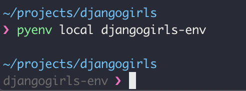

명령어를 치기 전에는 일반적인 디렉토리를 탐색하는 콘솔이었지만, 명령어를 입력하고 나니 python 가상환경 안으로 들어왔습니다!

#### 가상환경 확인하기
앞서 말했다시피 다양한 `python` 가상환경을 구축할 수 있기 때문에, 현재 가상환경이 어떤 걸 구동한 건지 궁금할 때가 있겠죠? 그럴땐 `pyenv version`을 사용합니다.

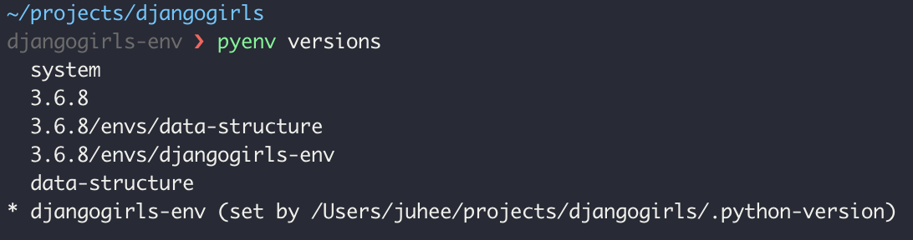

오.. 생각보다 많은 가상환경이 있었어요 XD. 그 중 현재 구동되어 있는 가상환경 앞에 * 표시가 붙습니다.

그럼 **이 가상환경에 어떤 패키지가 포함되어 있는지 확인하려면 어떻게 해야할까요?**
요건 가상환경과 상관없이, python package manager 명령어인 pip를 사용하여 알 수 있습니다.

```sh
pip list
```

### PyCharm
`python` 프로젝트를 진행하면서 사용할 IDE는 [PyCharm](https://www.jetbrains.com/pycharm/)을 사용합니다.

**jetbrains의 PyCharm**은 학생 이메일 계정으로 인증하면 1년간 무료로 사용할 수 있으니 참고하세욧!

### DB Browser for SQLite
백엔드 프로젝트를 진행하면 자연스럽게 Database를 다루게 되겠죠? Database GUI 툴인 [DB Browser for SQLite](https://sqlitebrowser.org/)를 설치해줍시다!

### Django
쟝고 스터디를 하려면 쟝고프레임워크를 깔아야겠죠! 위의 파이썬 개발환경 구축이 정상적으로 완료되었다면, `pip` 명령어를 통해서 Django 를 설치할 수 있습니다.

```sh
pip install Django
```

이제 개발환경 셋팅이 끝났다면, 본격적으로 Django 스터디를 시작하죠 :)


## Django 란?
**Django girls**에 따르면,


Django는 파이썬으로 만들어진 **무료 오픈소스 웹 애플리케이션 프레임워크(web application framework)**입니다. 쉽고 빠르게 웹사이트를 개발할 수 있도록 돕는 구성요소로 이루어진 웹 프레임워크랍니다.

웹사이트를 구축할 때, 비슷한 유형의 요소들이 항상 필요한데요, Django에는 회원가입, 로그인, 로그아웃과 같이 사용자 인증을 다루는 방법이나 웹사이트의 관리자 패널, 폼, 파일 업로드 등 웹 프로젝트에서 바로 사용할 수 있는 구성요소들을 갖춘 프레임워크입니다.

개인적으로는 관리자 페이지를 만들지 않아도 된다는 점이 제일 끌렸어요! :)

### Django Girls
저희의 첫 번째 장고 프로젝트로 [Django Girls](https://tutorial.djangogirls.org/ko/)를 따라하기로 했어요. 다행히 한국어이고, 기초가 부족한 분들을 위해서 하나부터 열까지 다 설명해주고 있어서 혼자서도 할 수 있도록 만들어진 매우 훌륭한 튜토리얼입니다.

그래서 이번 주 스터디(그리고 포스팅)의 목표는 다음과 같습니다.
* `Django` 프로젝트 환경을 구축한다.
* `Django` 프로젝트로 웹 서버를 띄운다.
* 프로젝트의 모듈을 생성한다.
* 프로젝트에 사용될 Model을 생성하고 DB에 추가한다.
* 추가 URL을 등록하고 View를 랜더링한다.
* Model을 관리할 수 있는 관리자페이지를 만든다.

그리고 숙제는 Django Girls를 **혼자서 진행해보는 것**입니다. 하하하. 뭔가 갈 길이 멀지만 후다다다닥 해볼게용.

### Django Project 생성하기

자 이제 Django 프로젝트를 만들어봅시다. 프로젝트의 이름은 `mysite`로 하고, 위치는 현재 위치(~/projects/djangogirls)에서 시작하죠.
```sh
django-admin startproject mysite .
```

그리고 나서 현재 위치를 살펴보면?!
```sh
ls -al
```

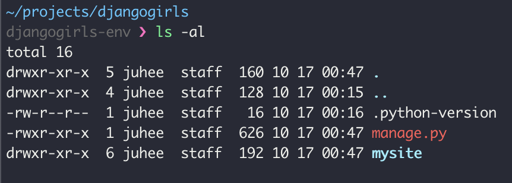
짜잔~ django 프로젝트에 필요한 파일들이 설치되었습니다. 그리고 이제 이 폴더를 PyCharm에서 열어보죠.

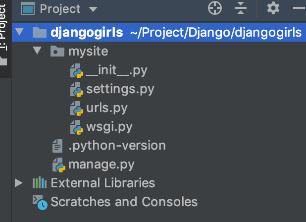

간단하게 살펴보면, 프로젝트를 생성한 가장 최상위 프로젝트 루트인 `djangogirls`가 있고, 프로젝트를 시작할 때 적어주었던 `mysite`라는 이름을 가진 패키지가 있습니다. 그리고 파이썬 관련 버전을 나타내는 듯한 `.python-version`파일이 있고, `manage.py`파일이 있군요.

#### manage.py
`manage.py`는 스크립트 파일로, 사이트 관리를 도와주는 역할을 합니다. 이 스크립트로 다른 설치 작업 없이, 컴퓨터에서 웹 서버를 시작할 수 있습니다.
Django 프로젝트를 진행하면서 필요한 기능 (Application 추가, Database migration, admin 사용자 추가 등등)들에 대한 스크립트를 포함하고 있습니다.

#### settings.py
`mysite` 패키지 하위에는 `settings.py`라는 파일이 있는데요, 이 파일은 웹사이트와 관련된 설정을 작성하는 파일입니다.

처음 프로젝트를 생성한 상태에서 이 파일을 열어보게 되면 엄청난 양의 기본코드들이 들어가 있습니다. 이 프로젝트에 필요한 django 어플리케이션들이나, middleware, database, language-code 등 다양한 기본 설정들이 들어가 있습니다.

추가적으로 필요한 설정들이 있다면 여기에서 수정할 수 있습니다.

#### urls.py
`urls.py`는 왠지 이름에서 부터 그 역할을 유추할 수 있을 것 같죠? 바로 이 프로젝트의 url들을 관리하는 파일입니다. 한 번 열어보면?

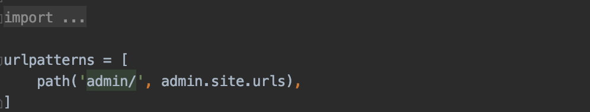

오잉, 아무것도 만들지 않았는데 이미 `admin`이라는 url path가 있군요. 이미 우릴 위해 만들어진 admin 페이지가 있는 건 아닐까요?

### Django 서버 구동하기
이 django 프로젝트를 실제 브라우저환경에서 보려고 하면 어떻게 해야할까요? 아까 `manage.py`를 설명하면서 이 스크립트 파일을 사용하면 별도 설치 없이 웹 서버를 시작할 수 있다고 했습니다 :) 한 번 실제로 그렇게 되는지 살펴보죠.

```sh
python manage.py runserver
```

> 팁!
> PyCharm 하단 툴바의 Terminal을 누르면 console을 사용할 수 있습니다.
> PyCharm 과 다른 console 프로그램을 열지 않아도 되서 간편하죠?

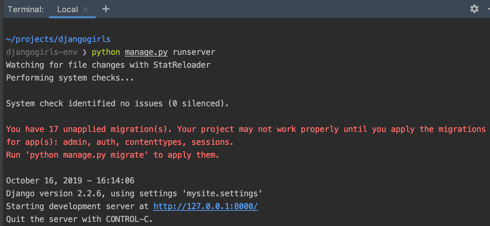

오옹.. 문구를 살펴보니 **파일 변화를 StatReloader**가 지켜본다고 이야기 하고, 시스템 체크가 끝난다음... 알 수 없는 경고 문구가 뜬 다음 **http://127.0.0.1:8000/**에 서버가 시작했다고 알려주네요!

친절하게 서버를 종료하려면 `Control + C`를 누르라고도 적혀있어요 XD

진짜 서버가 떳는지 궁금하다면? [http://127.0.0.1:8000/](http://127.0.0.1:8000/)를 열어봅시다!

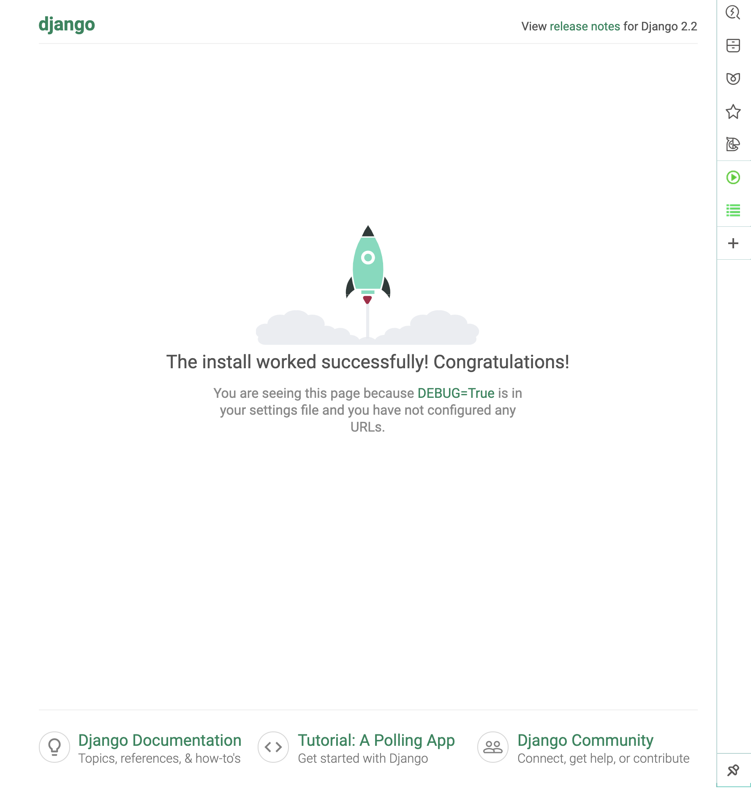

오.. 아무것도 하지 않았는데 Django 프로젝트를 시작한 것 만으로도 **웹 서버를 띄우고**, **localhost에 admin**페이지가 뜨는군요!

신기신기신기..! 과거 Tomcat 열심히 깔아서 쓰던 유저는 그저 마냥 신기합니다. 앞으로의 스터디가 더 기대되요 :)

## Blog Application 만들기
### Django 에서 Application 이란?
하나의 웹 프로젝트는 다양한 단위로 세분화할 수 있습니다. 예를 들어 네이버 사이트를 만든다고 생각했을 때 네이버 검색, 블로그, 카페, 쇼핑 등등 하나로 개발하기에는 너무나도 큰 규모의 프로젝트를 진행해야 한다면 각 기능별로 나누어 볼 수 있겠죠. 그리고 그 각각의 기능들이 Django 에서는 **Application**이 됩니다.

### Application 추가하기
한 프로젝트에 다수의 Application들이 추가하려면 어떻게 해야할까요? 앞서 소개되었던 `manage.py`가 이미 Application을 생성하는 명령어를 가지고 있습니다. blog Application을 추가하기 위해 `manage.py`에 포함된 `startapp` 이라는 명령어를 사용해봅시다.

```sh
python manage.py startapp blog
```

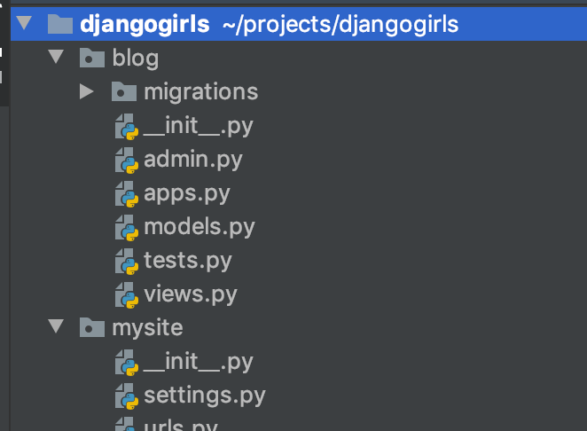

오 프로젝트에 또 다른 패키지가 생겼네요. 이 패키지는 `migrations`라는 하위 패키지를 가지고 있고, `admin.py`, `apps.py`, `models.py`, `test.py`, `view.py` 를 가지고 있네요.

다른 것들은 찬찬히 살펴보기로 하고, 우리의 목표를 위해 먼저 `model.py`를 살펴봅시다.

### Model 클래스 추가하기
블로그에는 포스팅이 있어야겠죠? 지금 제가 쓰고 있는 것 처럼요 ㅎㅎ. 지금 `model.py` 파일을 열어봐도 아무것도 보이지 않습니다. 여기에 모델을 만드세요- 라고만 적혀져 있네요. 이제 Post 라는 Model class를 추가해봅시다.

```python
from django.db import models


class Post(models.Model):
    author = models.ForeignKey(settings.AUTH_USER_MODEL, on_delete=models.CASCADE)
    title = models.CharField(max_length=200)
    text = models.TextField(blank=True)
    created_date = models.DateTimeField(default=timezone.now)
    published_date = models.DateTimeField(blank=True, null=True)

    def publish(self):
        self.published_date = timezone.now()
        self.save()

    def __str__(self):
        return self.title
```

네 이렇게 따라서 치시면 아마 빨간줄로 뭐가 없어~~라고 PyCharm이 알려줄거에요. 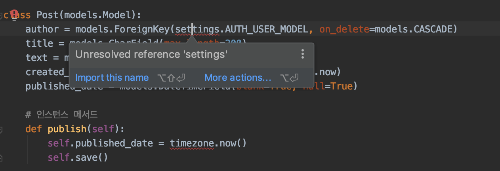

그럼 `import this name`을 눌러줍시다. (혹은 Alt + Enter) 요렇게 두 번만 하면?

```python
from django.conf import settings
from django.db import models
from django.utils import timezone


class Post(models.Model):
    author = models.ForeignKey(settings.AUTH_USER_MODEL, on_delete=models.CASCADE)
    title = models.CharField(max_length=200)
    text = models.TextField(blank=True)
    created_date = models.DateTimeField(default=timezone.now)
    published_date = models.DateTimeField(blank=True, null=True)

    def publish(self):
        self.published_date = timezone.now()
        self.save()

    def __str__(self):
        return self.title
```

이런식으로 필요한 항목들을 import 할 수 있습니다. 하지만 같은 패키지명을 가지는 경우가 많기 때문에 import 할 때는 주의를 기울여야해요 :)

코드를 잠깐 살펴보죠. 처음 세 줄은 필요한 패키지들을 import 해온 코드입니다.

다음으로 `Post`라는 클래스를 정의해주었는데요, 특이한 점은 `Post(models.Model)` 요 부분입니다. 이렇게 class를 정의하면서 `django.db`의 `models.Model`을 명시해주면 이 클래스를 기반으로 데이터베이스의 Entity가 만들어질 것이다- 라고 알려주게 됩니다.

#### attribute

그럼 이제 이 `Post` 클래스에 어떤 attribute가 포함되는지 정의해줍시다.
> `python`에서는 클래스 정의에 `{ }`를 사용하지 않고, tab을 기반으로 정의부인지 아닌지를 구분합니다.

`Post` 클래스에는 5개의 attribute가 포함됩니다. 코드를 그대로 읽어볼까요?

* author는 settings의 `AUTH_USER_MODEL`와 연결된 외래키이고, 이 외래키가 삭제될 때 `CASCADE` 옵션을 가집니다. 함께 삭제된다는 거죠.
* title은 최대 길이가 200인 `Character Field`입니다.
* text는 `Text Field`이며, 비어있을 수 있습니다.
* created_date 는 날짜와 시간을 저장하는 `DateTimeField`이며, 기본값은 인스턴스가 생성괴는 시점입니다.
* published_date 또한 `DateTimeField`이며, null일 수도, 비어있을 수도 있습니다.

> **blank vs null**
>
> 두 가지는 유사하지만 조금 다릅니다.
> blank는 Application 시점에서 이 값이 필수인지 아닌지를 판단하게 될 때 사용됩니다.
> null은 Database에서 이 값이 nullable 한지 여부를 나타냅니다.
>
> 예를 들어서 `published_date`의 옵션이 `blank=True, null=False`라면, 사용자가 포스팅을 작성했을 때 `published_date`를 입력하지 않아도 포스팅을 작성할 수 있지만 데이터베이스에서는 null이 허용되지 않기 때문에 자동으로 기본값을 지정해주거나 `created_date`값과 동일하게 가져가는 등의 처리를 해주어야 합니다.

#### method

`Post` class에는 총 두 개의 instance method가 정의되어 있습니다. 첫 번째로 포스팅을 발행(publish)하는 메서드, 그리고 인스턴스 클래스를 나타낼 때 사용하는 Description 메서드(일명 매직메서드래요).


python에서 정의할 수 있는 method는 instance method/static method/class method의 3 종류가 있는데, 다음에 python 문법을 살펴보면서 좀 더 자세히 알아봅시다.

### Database Migration
자 이제 열심히 새로운 Model 클래스를 생성했으니까, 이걸 database에 적용해봅시다. 이렇게 새로운 변경사항을 database에 적용하는 걸 `migration`이라고 부릅니다.

아까 Application을 추가한 것처럼, 프로젝트를 관리하는 `manage.py`에게 database에 변동사항이 있어! 라고 알려줍시다.

```sh
python manage.py makemigrations blog
```

그럼 다음과 같은 오류문구가 나타납니다.

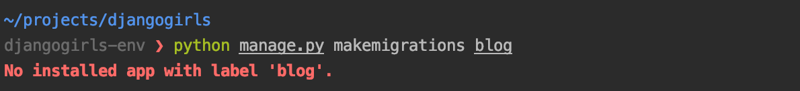

음????? 아냐 나 blog 앱 만들었는데? 혹시 제가 누락한 것 같으니까 다시 만들어봅시다.

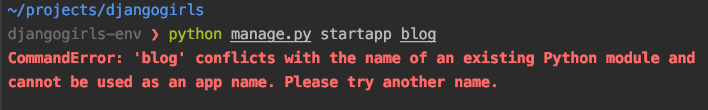

ㅎㅎㅎㅎㅎㅎㅎㅎㅎㅎㅎㅎㅎㅎㅎㅎㅎㅎㅎㅎㅎㅎ 있는데 왜 찾지를 못하니..!!!!!!!

Application을 생성하는 것은 자동으로 해주지만, **모든 Application이 자동으로 프로젝트에 포함되는 것은 아닙니다.** 필요에 따라 기존 Application이 빠져야 할 수도 있고, 아직 개발중이라서 못 넣을 수도 있잖아요!

프로젝트에 어떤 Application들이 포함될지는 `settings.py`에서 결정합니다.

`settings.py`에 'blog'라는 이름의 application이 포함될 거라고 적어줍시다. 한 줄을 비운 이유는 기존 django 모듈들과 구분하고자 한 줄을 비워두었습니다.

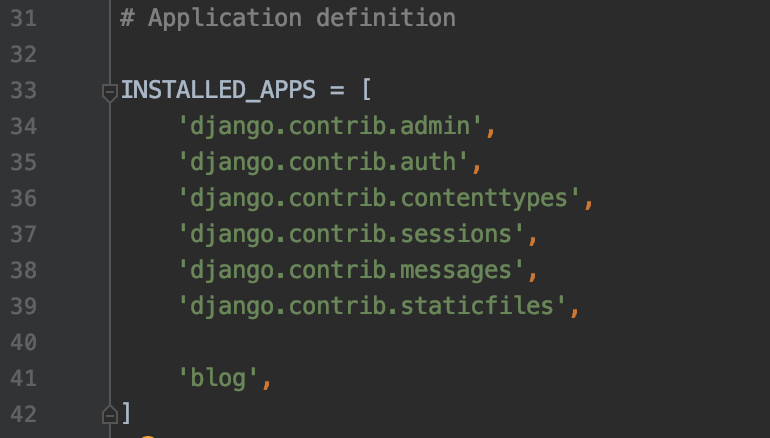

자 이제 `blog` Application도 넣었으니 다시 migration 명령어를 입력해봅시다. `blog/migrations/0001_initial.py`라는 처음 보는 파일 이름에 - Create model Post 를 보여주고 마무리가 됩니다.

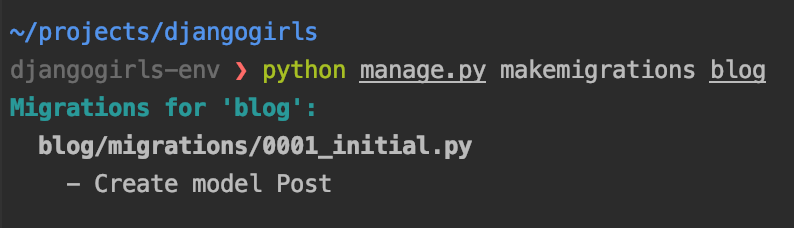

실제로 프로젝트 네비게이터에서 blog/migrations 폴더 하위에 새로운 파일이 생긴 걸 확인할 수 있습니다.

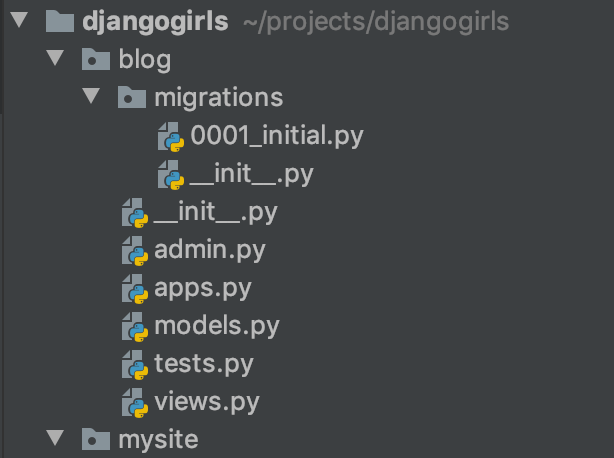

#### Database Migration 적용하기
migration 파일이 생성되었다고 해서 데이터베이스에 적용되는 것은 아닙니다. migration 파일은 일종의 임시저장 이라고 보면 될 것 같아요. 기존에서 현재까지의 변동사항을 하나의 파일로 저장해둡니다.

이후에 다른 변동사항이 생긴다면, 또 다른 migration 파일을 생성해서 관리할 수 있습니다.

migration 파일을 실제 database에 적용하려면, `manage.py`의 migrate 명령을 사용할 수 있습니다.

```python
python manage.py migrate
```

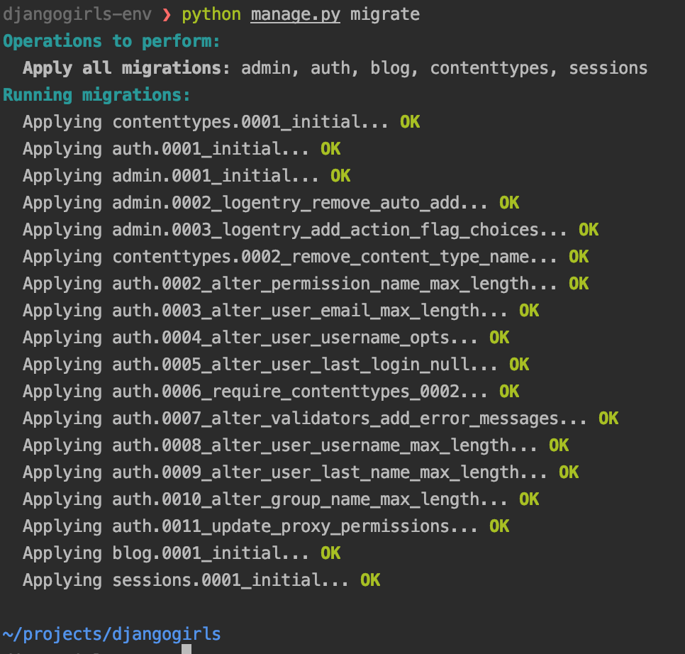

오.. 제가 생성한 migration 파일은 하나지만, 이 프로젝트에서 사용하는 django 기본 application에 필요한 database migration이 자동으로 진행됩니다.

자 그럼 이제 migration이 끝났는데, 그 결과를 어디가야 볼 수 있을까요?

#### Database 확인하기
맨 처음 blog application을 생성했을 때, 프로젝트에 뭔가 새로운 파일이 생긴 것을 알아채셨나요?

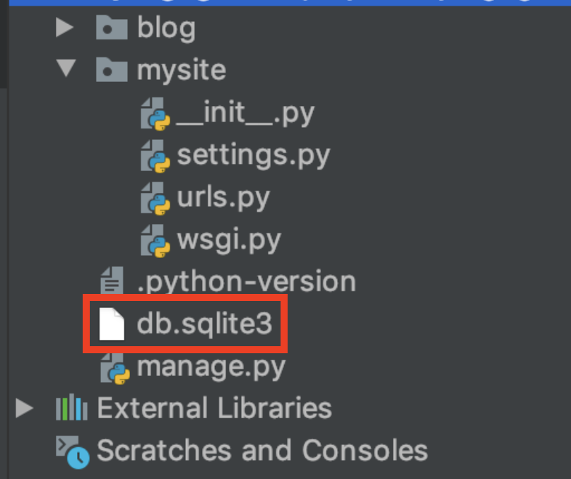

blog application을 추가하면서 database 사용을 위해 blog 패키지 하위에 migrations 패키지가 생긴 것처럼, 프로젝트에서도 database를 사용하기 위해 `db.sqlite3` 파일이 추가되었습니다.


Django 프로젝트에서는 `.sqlite3`를 사용해서 Database를 관리하고, 이 파일을 DB Browser SQLite를 통해 열면 Database 내부의 데이터를 확인할 수 있습니다.

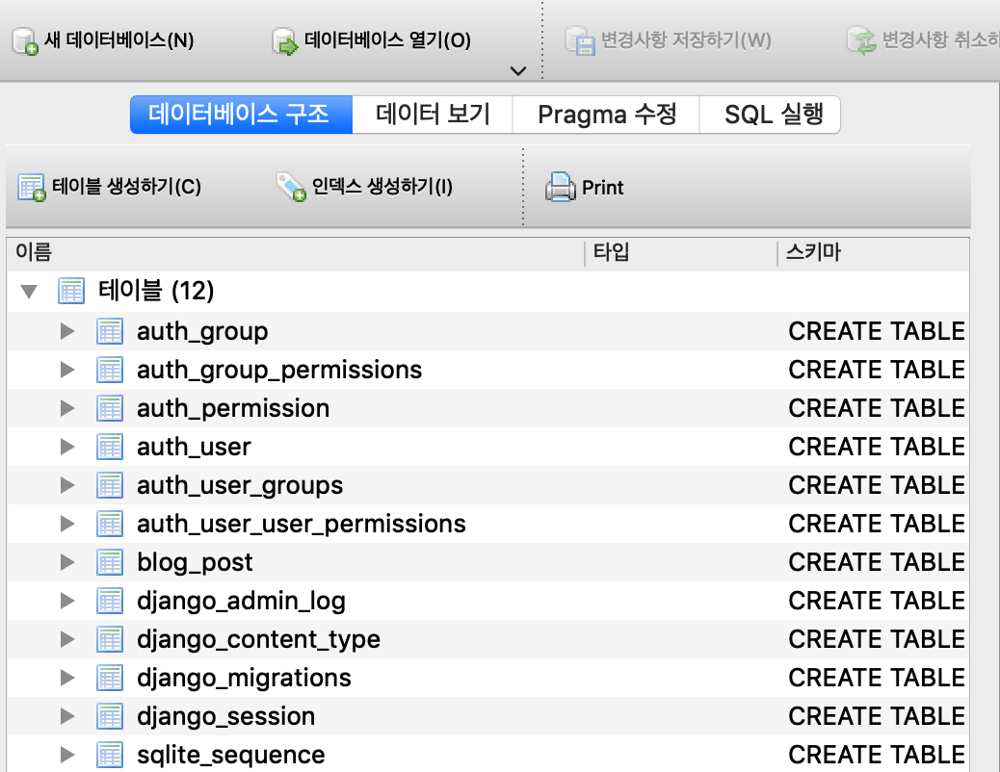

잘 찾아보면 우리가 만들었던 `blog` application의 `post` model을 나타내는 테이블을 찾을 수 있을거에요.

하지만 이 테이블을 열어봐도 아무런 데이터가 나타나지 않습니다 ㅠ_ㅠ 왜냐면 데이터가 없으니까요! (아무말)

그럼 이제 데이터를 넣을 수 있는 **관리자 페이지**를 만들어봅시다.

### 새로운 페이지 추가하기
관리자 페이지를 만들어보기 전에, 우리가 생성한 새로운 페이지를 프로젝트에 추가해봅시다.

#### URL 추가하기
새로운 페이지를 보여주려면, 그 페이지에 접속할 URL을 만들어야하겠죠? URL의 관리는 `mysite/urls.py`에서 관리할 수 있습니다.

우리는 포스팅 리스트를 볼 수 있는 페이지를 만들거에요. URL은 `post-list`로 만들어 봅시다.

```python
from blog.views import post_list

urlpatterns = [
    path('admin/', admin.site.urls),
    path('post-list/', post_list),
]
```

path(,)의 첫 번째 파라미터는 URL을 나타내고, 두 번째 파라미터는 이에 대응하는 실제 view를 나타냅니다. 이 상태에서 `urls.py`를 저장하면 runserver에서 오류로그가 막 올라옵니다.

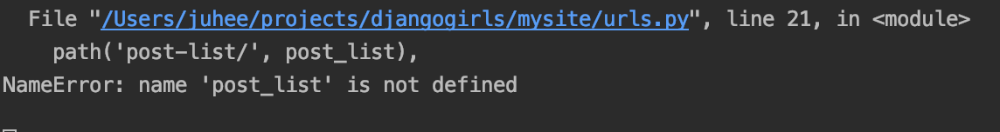


빠밤.. `post_list`라는 걸 찾을 수 없다네요... 역시 인생 쉽지 않아요. ㅜ

URL은 등록하려면 이 url에 대응되는 view를 반환해주어야하나 봅니다. 그럼 이제 view를 추가하러 갑시다.

#### View 추가하기
페이지 관리는 `views.py`에서 관리합니다.

급한 불을 끄려면 일단 `post_list` 를 요청할 때 String 문자열이라도 내보내줍시다.

```python
def post_list(request):
    return HttpResponse('Post List!')
```

이 메서드는 request를 받았을 때, 이 request에 대한 응답으로 `HttpResponse`라는 클래스의 인스턴스를 생성해서 전달해줍니다. 생성자의 파라미터로는 간단하게 'Post List!'라고 적어주었습니다.

그리고 나서 `urls.py`로 돌아가서 `views.py`의 `post_list`를 참조할 수 있도록 import 해줍시다. 그리고 나서 저장을 하면~ 정상적으로 서버가 다시 시작됩니다.

이제 실제 브라우저에서 [http://127.0.0.1:8000/post-list/](http://127.0.0.1:8000/post-list/)에 접속해봅시다.

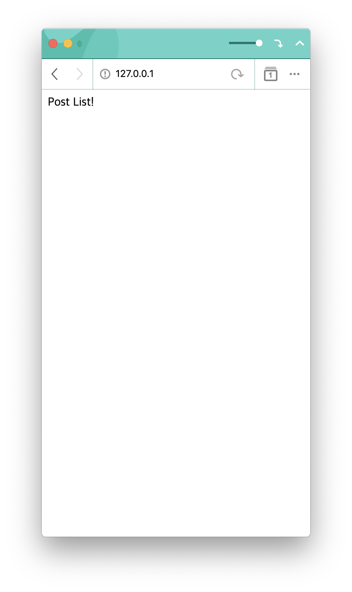

잘 뜨시나요? 오와앙 우리의 첫 번째 페이지를 띄우는 데 성공했습니다.

#### HTML 파일 보여주기
사실 웹 페이지라고 하면 보통 HTML 파일을 먼저 떠올리기 마련입니다.

사실 급한 불은 껏지만, 우리가 원했던 건 한 줄의 문자열보단 예쁜! 화면을 만들어나가는 거겠죠. 그럼 우리가 알고 있는 html 파일을 보여주려면 어떻게 해야할까요?

먼저 간단한 html 파일을 만들어봅시다. 저는 프로젝트 최상단에서 `/templates/post_list.html` 파일을 생성하고 다음과 같이 써넣었습니다.

```html
<!Doctype html>
<html lang="ko">
<head>
    <meta charset="UTF-8">
    <meta name="viewport"
          content="width=device-width, user-scalable=no, initial-scale=1.0, maximum-scale=1.0, minimum-scale=1.0">
    <meta http-equiv="X-UA-Compatible" content="ie=edge">
    <title>Document</title>
</head>
<body>
    <h1>post list</h1>
</body>
</html>
```

이제 `post_list`를 요청했을 때 이 html 파일이 불러와지도록 만들어봅시다. 그럼 앞서 작성했던 `post_list(request)` 메서드를 조금 수정합니다. :)

```python
def post_list(request):
    return render(request, 'post_list.html')
```

`render(,)` 메서드는 request를 받아서 이에 대응되는 HttpResponse 인스턴스를 만들어주는 메서드이며, 두 번째 파라미터로 사용할 resource 파일 이름을 받았습니다. 그러면 프로젝트 내에서 `post_list.html`을 찾아서 랜더링하여 response를 보냅니다.

메서드를 수정하고 다시 브라우저 화면을 새로고침해볼까요?

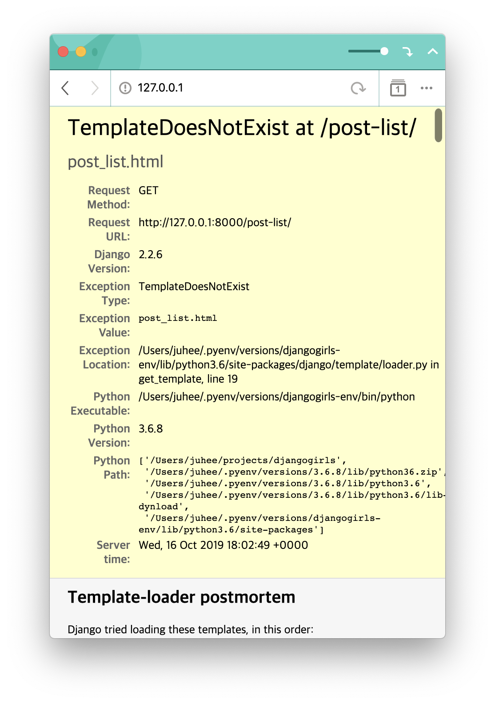

오옷.... 그런 template을 찾을 수 없다는 군요. 마찬가지로 template 또한 settings.py의 TEMPLATES의 DIRS 하위에 path를 명시해주어야 합니다.

```python
TEMPLATES = [
    {
        'BACKEND': 'django.template.backends.django.DjangoTemplates',
        'DIRS': [
            os.path.join(BASE_DIR, 'templates')
        ],
        'APP_DIRS': True,
        'OPTIONS': {
            'context_processors': [
                'django.template.context_processors.debug',
                'django.template.context_processors.request',
                'django.contrib.auth.context_processors.auth',
                'django.contrib.messages.context_processors.messages',
            ],
        },
    },
]
```

다시 한 번 돌려볼까요!


굳굳! 이런 방식으로 원하는 위치의 html 파일을 불러올 수 있습니다. 나중엔 템플릿 파일을 가지고 동적으로 데이터바인딩하는 부분 또한 다뤄볼 수 있겠네요.

### 관리자 페이지 관리
관리자 페이지 관리라니 저의 라임이 아주 날로 갈 수록 무르익는군요. 하하. 지금 새벽 세시라서 매우 졸려서 그렇습니다. 봐주십쇼. 저희 스터디의 마지막 목표는 바로 **포스트 리스트를 볼 수 있는 관리자 페이지**를 띄우는 것이었습니다.

그럼 관리자 페이지는 어떻게 만들 수 있을까요? 아까 제가 듣기로는 Django에서 관리자 페이지 만드는 게 참참참 쉽다고 들었는뎁쇼! XD

관리자 페이지 만드는 법! 아주 간단합니다.

#### admins.py
관리자 페이지는 `admins.py`에서 관리합니다. 여기에 관리할 model을 적어주기만 하면 됩니다.

```python
from django.contrib import admin
from .models import Post

admin.site.register(Post)
```

오 이게 단가요? 네 이게 답니다. 그럼 이제 [admin 페이지](http://127.0.0.1:8000/admin)에 들어가봅시다.

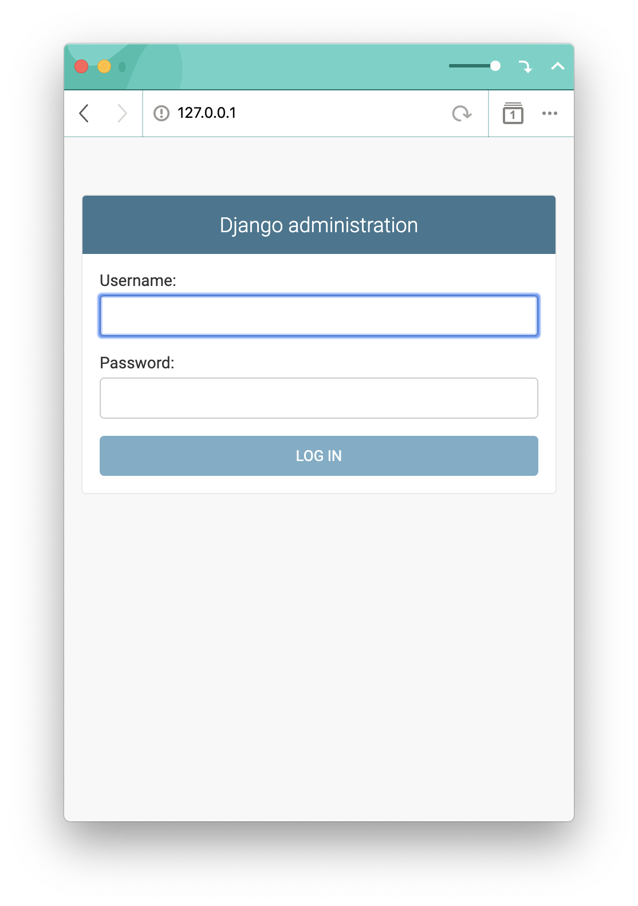

음.... 저는 아이디와 비밀번호가 없는뎁쇼? 그럼 이제 만들어봅시다 XD

#### 로컬 사용자 만들기
admin 페이지에 접속할 수 있는 local 유저를 생성하는 것 또한 `manage.py`
 스크립트를 사용합니다.

 ```python
python manage.py createsuperuser

 ```
그럼 이제 아이디를 뭘 할 건지, 이메일, 비밀번호, 비밀번호 이거 너무 쉬운데 이거 쓸거니 하고 물어봅니다.
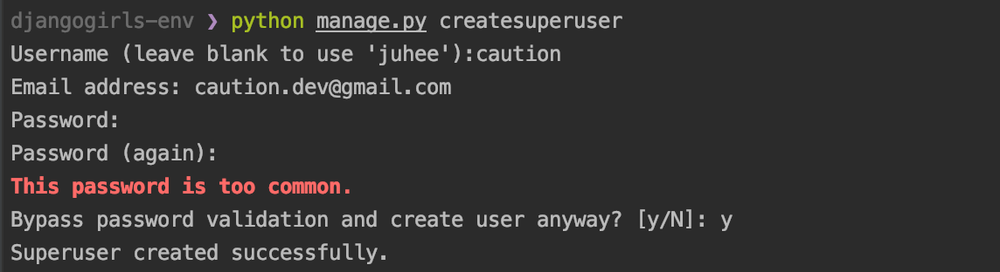

저는 쿨하게 y했구요. 이제 만든 사용자로 로그인을 해봅시다.

> 혹시 저처럼 비밀번호를 잊어버리신 분이 있다면
> `python manage.py changepassword`를 사용하여 변경할 수 있으니 걱정마세요!

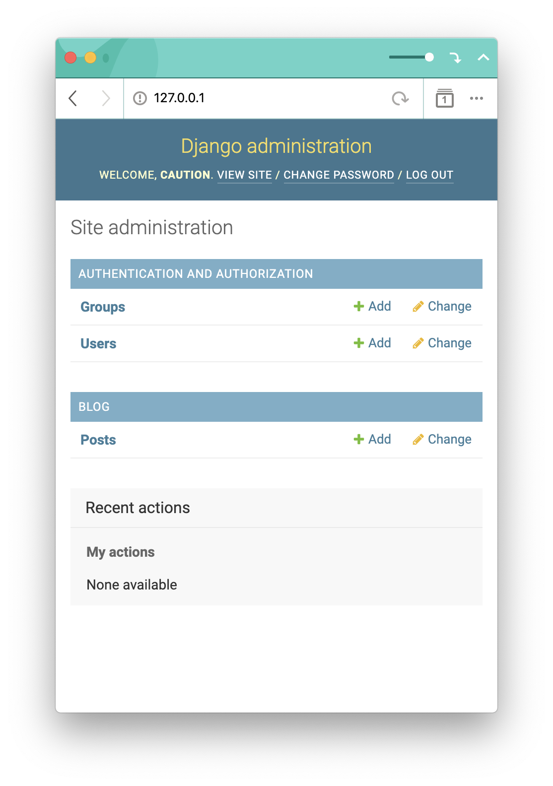

우왕! 관리자 페이지가 열렸네요~ 여기에서 새로운 post 를 작성하고 기존 데이터들도 관리할 수 있습니다.

그리고 변경된 데이터는 DB Browser 에서 확인할 수 있다는 점~~ 잊지마시고용!


길고 긴 포스팅이 끝났습니다!!!!!!!!!!

다음엔 좀 더 짧은 호흡으로 포스팅 올릴게요 XD

다 쓰고 나니까 세시라서 핵졸려요

구롬 20000!!!!
